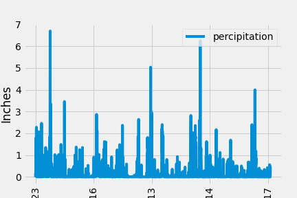
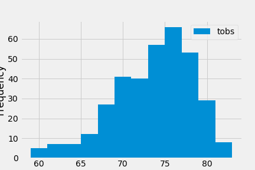
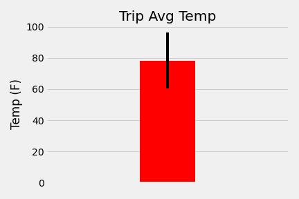
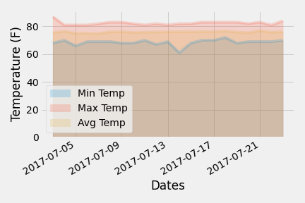

# SQLAlchemy - Surfs Up!


## Background

We've decided to go into a long vacation to Honolulu, Hawaii! To help with the trip planning, 
we need to do some climate analysis on the area.

## Analysis
 
We break our analysis into several steps as follow:

### Step 1 - Climate Analysis and Exploration

To begin, wr use Python and SQLAlchemy to do basic climate analysis and data exploration of climate database. 
All of the following analysis were completed using SQLAlchemy ORM queries, Pandas, and Matplotlib.

* Used the [hawaii.sqlite](Resources/hawaii.sqlite) files to complete climate analysis and data exploration.

* Choose a start date and end date for the trip. Making sure that the vacation range is approximately 3-15 days total.

* Used SQLAlchemy `create_engine` to connect to sqlite database.

* Used SQLAlchemy `automap_base()` to reflect tables into classes and save a reference to those classes called `Station` and `Measurement`.

### Precipitation Analysis

* Design a query to retrieve the last 12 months of precipitation data.

* Select only the `date` and `prcp` values.

* Load the query results into a Pandas DataFrame and do data clean up.

* Plot the results using the DataFrame `plot` method.

#### <a id="precipitation"></a>Precipitation


* print the summary statistics for the precipitation data.

#### <a id="summary-statistics"></a>Summary Statistics


### Station Analysis

* Design a query to calculate the total number of stations.

* Design a query to find the most active stations.

  * List the stations and observation counts in descending order.

  * Which station has the highest number of observations?

* Design a query to retrieve the last 12 months of temperature observation data (TOBS).

  * Filter by the station with the highest number of observations.

  * Plot the results as a histogram with `bins=12`.

#### <a id="histogram"></a>Station Histogram


- - -

## Step 2 - Climate App
We designed a Flask API app based on the queries that we developed to make easy to query our data.

 * Flask used to create data routes.

### Routes

* `/`

  * Home page.

  * List all routes that are available.

* `/api/v1.0/precipitation`

  * Convert the query results to a dictionary using `date` as the key and `prcp` as the value.

  * Return the JSON representation of the dictionary.

* `/api/v1.0/stations`

  * Return a JSON list of stations from the dataset.

* `/api/v1.0/tobs`

  * Query the dates and temperature observations of the most active station for the last year of data.
  
  * Return a JSON list of temperature observations (TOBS) for the previous year.

* `/api/v1.0/<start>` and `/api/v1.0/<start>/<end>`

  * Return a JSON list of the minimum temperature, the average temperature, and the max temperature for a given start or start-end range.

  * When given the start only, calculate `TMIN`, `TAVG`, and `TMAX` for all dates greater than and equal to the start date.

  * When given the start and the end date, calculate the `TMIN`, `TAVG`, and `TMAX` for dates between the start and end date of vacation.

- - -

## Step 3 - broken into several steps.

### Temperature Analysis I

* Hawaii is reputed to enjoy mild weather all year. Is there a meaningful difference between the temperature in, for example, June and December?

* Identify the average temperature in June at all stations across all available years in the dataset. Do the same for December temperature.

* Use the t-test to determine whether the difference in the means, if any, is statistically significant using paired t-test.

#### <a id="test"></a>Station Ttest Results
```
Ttest_relResult(statistic=17.003165938723054, pvalue=1.4530971041972015e-07)
```

### Temperature Analysis II

* Created a `calc_temps` function that will accept a start date and end date in the format `%Y-%m-%d`. 

* The function will return the minimum, average, and maximum temperatures for that range of dates.

* Used the `calc_temps` function to calculate the min, avg, and max temperatures for the trip days.

* Plot the min, avg, and max temperature from your previous query as a bar chart.

  * Use the average temperature as the bar height.

  * Use the peak-to-peak (TMAX-TMIN) value as the y error bar (YERR).

#### <a id="temperature"></a>Temperature Chart


### Daily Rainfall Average

* Calculate the rainfall per weather station using the previous year's matching dates.

* Calculate the daily normals. Normals are the averages for the min, avg, and max temperatures.

* Created function `daily_normals` that will calculate the daily normals for a specific date. 

* This date string will be in the format `%m-%d`. Use all historic TOBS that match that date string.

* Create a list of dates for the trip in the format `%m-%d`. 

* Use the `daily_normals` function to calculate the normals for each date string and append the results to a list.

* Load the list of daily normals into a Pandas DataFrame and set the index equal to the date.

* Use Pandas to plot an area plot (`stacked=False`) for the daily normals.

#### <a id="daily-normal"></a>Daily Normals


